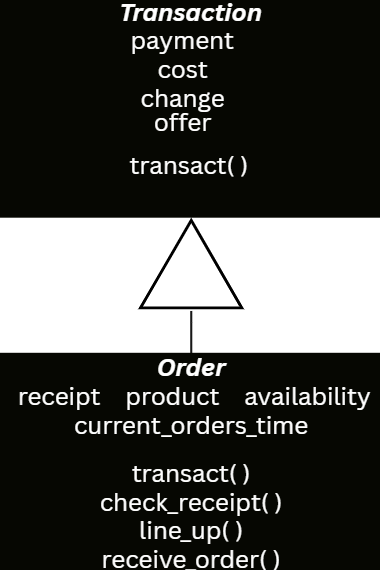
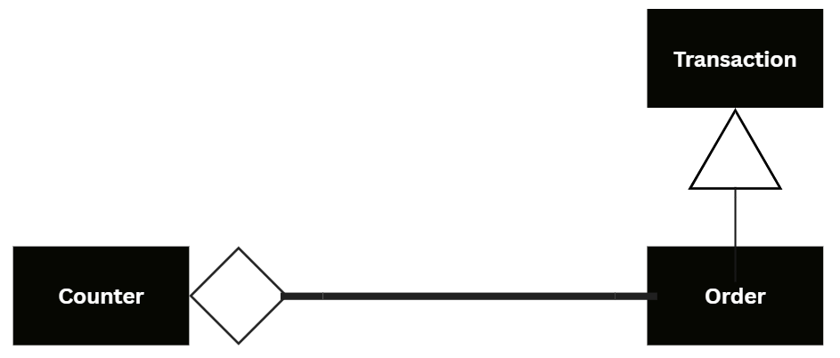
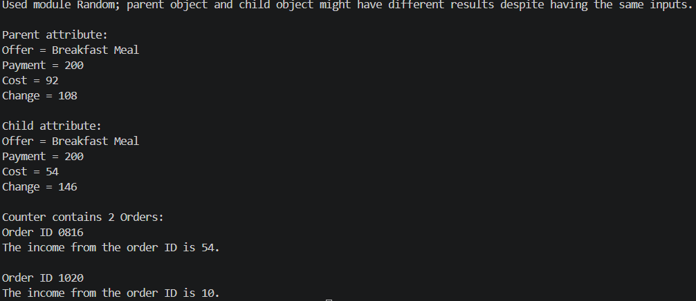
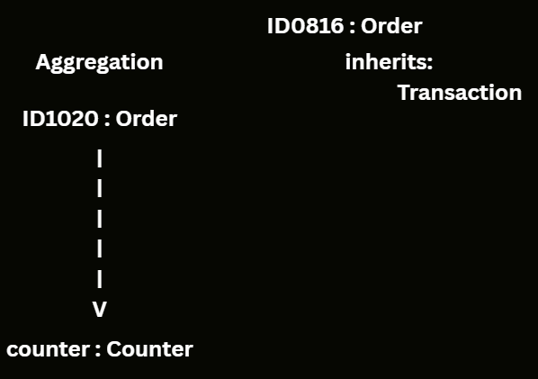

# Advanced Class Relationships
## Previous Activities
[classAttrib](classAttributesMethods.md)
[classRel](classRelationships.md)
## Existing System Description:
## Inheritance Relationship
**Parent: Transaction** 
**Child: Order**
**Explanation: Because an order is a type of transaction. An order can have additional values that a transaction doesn't. The order is a type of transaction.**
## Inheritance UML

## Composition/Aggregation
**Relationship: Aggregation**
**Explanation: Because the object from class Order can live without the object from class Counter. The counter only reads orders which makes it a weak relationship. The order is independent without it.**
## Advanced UML Diagram

## Python Implementation
[Source Code](advancedRelationships.py)
## Test Run

## Object Diagram

## Reflection
1. **Why did you choose your inheritance relationship? Explain why your child class is a type of your parent class.**
2. **How did inheritance reduce duplicate code? Identify attributes or methods that were reused.**
3. **Why is your HAS-A relationship Composition or Aggregation? Explain the lifecycle relationship between the two objects.**
4. **What is the difference between Association from Part III and the advanced relationship you implemented?**
5. **How does your design follow the DRY principle?**
**- Answers:**
> **To minimize the lines of code I will make. My child class is a type of the parent class. The child class can inherit everything from a class it is a type of.**
> **Inheritance reduced lines of code by making a general blueprint for the child classes. In my class Transaction, the class Order reused attributes offer, payment, cost, and change. The class Order did reuse transact() but modified it, making polymorphism.**
> **It is aggregation because the object is independent without the other. The object from class Order can function as a transaction without the object from class Counter. The class Counter functions as a reader that uses the Order to make out of something, not own it.**
> **The association from Part III does not specify if it has a strong or weak relationship. However it specifies how the object is using the other like HAS-A, USES-A, etc.. The advanced relationship is determined by how the association describes them.**
> **My design followed the DRY principle because I coded less. I used inheritance in order not to code the same code more than once. The child class inherits the parent class' attributes, deleting the purpose of coding again.**