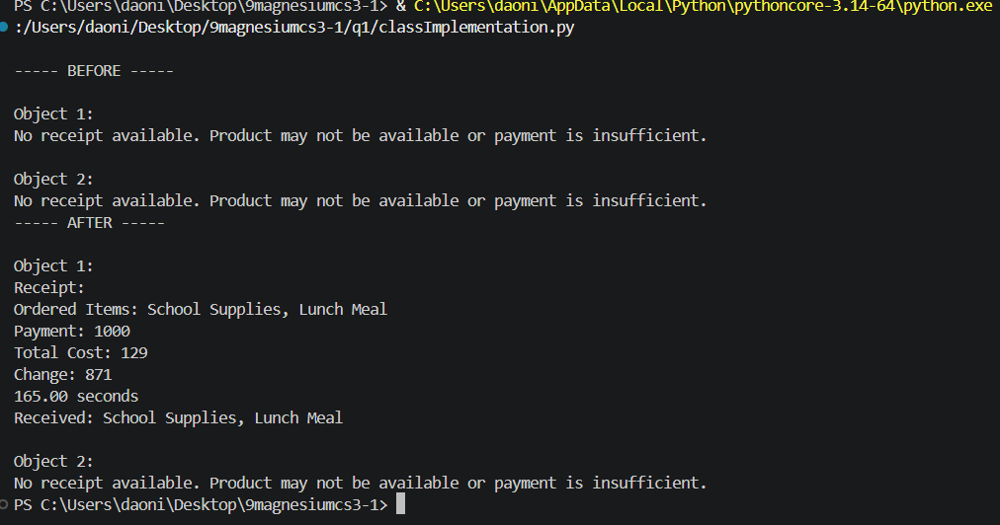
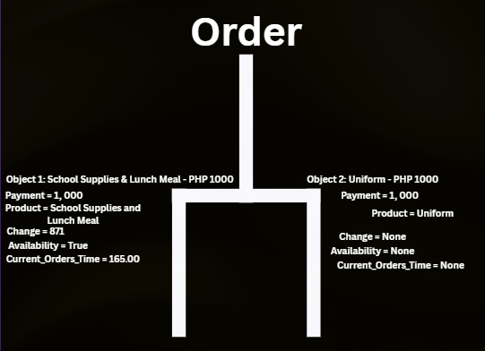

# Class Attributes and Methods
## Previous Design
**Link to my previous activity:**
[**classObjectUML.md**](classObjectUML.md)
## Design Revision
**Set Attributes and Methods to public and private.**
## Visibility Decisions
| **Attribute** | **Data Type** | **Visibility** | **Reason** |
|---|---|---|---|
| **product** | **string** | **public** | **So that the customer sees what he/she is buying** |  
| **payment** | **float** | **public** | **So that the customer can see how much he/she spent** |
| **change** | **int** | **public** | **To gain trust from the customer about the change** |
| **receipt** | **string** | **public** | **To allow the customer to view the transaction summary** |
| **cost** | **float** | **public** | **To tell the customer a certain product costs a certain value** |
| **current_orders_time** | **float** | **private** | **Hide it because there are factors that affect this value to change overtime, disappointing customers** |
| **availability** | **boolean** | **public** | **Tells the customer if the product is on stock or not** |
## Updated UML Class Diagram

## Python Implementation
[**View Python Source**](classImplementation.py)
## Test Run

## Object Diagram

## Analysis
### Why did you make your chosen attribute private?
**Because the customer doesn't always need to get the time to wait, the customer will either go to a line or not go at all.**
### Which method changes the state of your object?
**The method place_order(), it changes the values of some attributes**
### How did your two objects demonstrate that instances are independent?
**By having different results, one did not change, and the other has a modified result.**
### What is the difference between your class diagram and your object diagram?
**Class diagrams describe the methods and attributes of a class while Object diagrams compare the attributes of two objects from one class.**