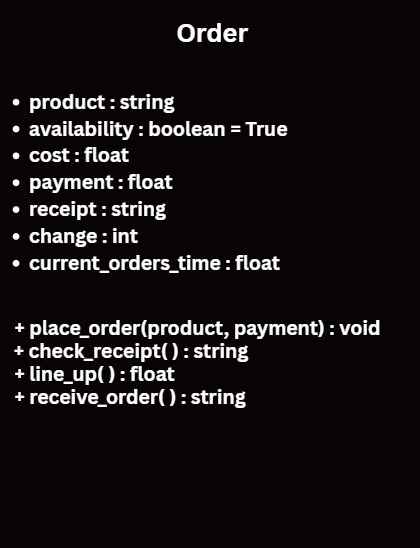

# SG4 - Understanding Classes and Objects

## Class Name:
**Order**

## Description:
**The class represents an order made by a consumer in the canteen.**

## Properties
| **Property** | **Data Type** | **Description** |
|---|---|---|
| **product** | **string** | **What the consumer wants** |
| **payment** | **float** | **What the consumer pays with** |
| **change** | **int** | **Rounded money received by the consumer** |
| **receipt** | **string** | **Summary of transaction** |
| **cost** | **float** | **Monetary value equal to the product(s)** |
| **current_orders_time** | **float** | **Time to be taken by current orders to be served before the consumer's.** |
| **availability** | **boolean** | **If the product(s) are available or not.** |

## Methods
| **Method** | **Description** |
|---|---|
| **place_order(product, payment)** | **Consumer orders their product(s), pay for it, and the receipt is given.**|
| **check_receipt()** | **Consumer can check the transaction summary** |
| **line_up()** | **Consumer will line up and wait for the time it took from current_orders_time.** |
| **receive_order()** | **Consumer will receive the order and the receipt is taken away.** |

## Class Diagram

## Design Explanation
### Why did you choose this class?
**To try convert a real-world process into code, running simulations to test fails and success within objects.**

### Which property is the most important? Why?
**The most important property was product, but there can't be any transactions done without the others. The product may be the most important for determining the cost from a dictionary, and is also because every other property varies to the product.**

### Which method is the most useful? Why?
**The most important method is place_order(product, playment) because it is where most of the logic is. It calculates everything, it creates a receipt, and asks for consumer input.**