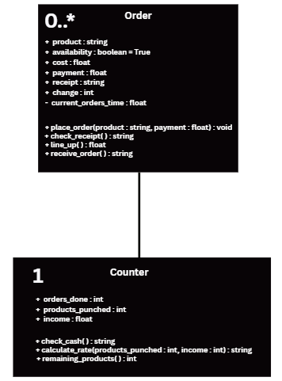
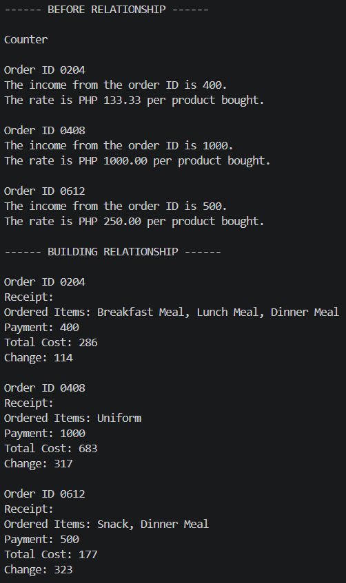
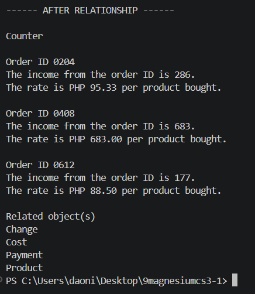
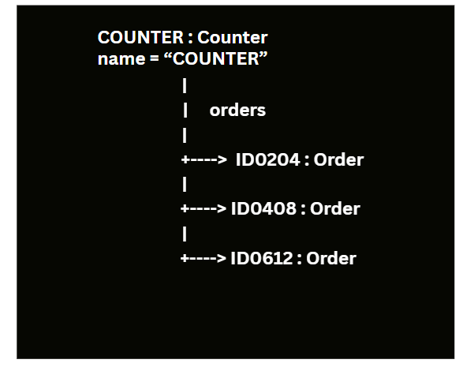

# Class Relationships: Association and Multiplicity
## Previous Work
[Part I - Classes and Objects](classObjectUML.md)
[Part II - Class Attributes and Methods](classAttributesMethods.md)
## Existing Class
**Class: Order** 
**Description: It is an order ID recorded from a customer, cannot be repeated.**
## New Related Class
**Class: Counter**
**Description: Analyzes the data under that specific order and give outputs.**
## Association
**Relationship: Counter can contain orders.**
**Explanation: The counter can can take orders and give the output depending on its data.**
## Multiplicity
**Multiplicity: Many-to-One**
**Explanation: One counter object is enough to process many order objects.**
## UML Class Relationship Diagram

## Python Implementation
[View Python Source](classRelationships.py)
## Test Run

## Object Relationship Diagram

## Analysis
### What is the association between your two classes?
**Aggregation because class Counter is dependent on the objects from class Order. The object from class Counter cannot be functional if the objects from class Order is absent. But the objects from class Order can be independent from class Counter.**
### What multiplicity did you choose and why?
**Many-to-One, so that the object from the other class could handle several order IDs at the same time.**
### How did you implement the relationship in Python?
**I used parameters and made sure no NameErrors occur, also adding global-scope variables.**
### Why did you store an object reference instead of copying its data?
**To minimize code.**
### If your relationship uses many, why is a list appropriate?
**To store many variables.**