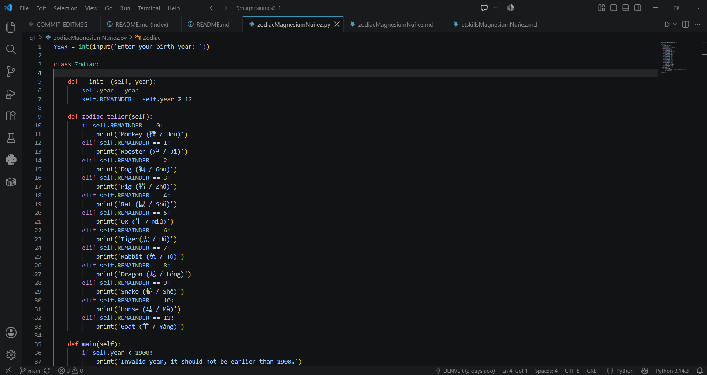
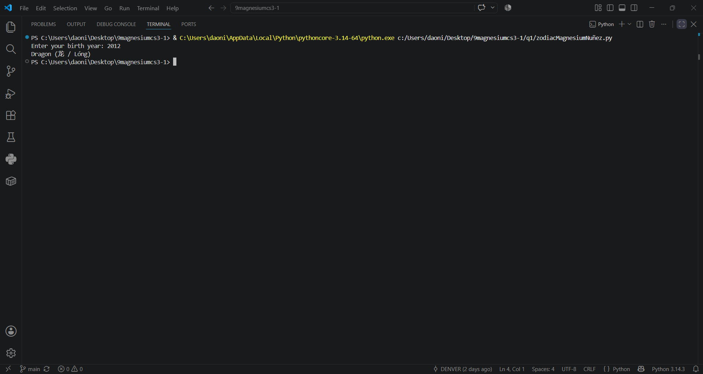

# Chinese Zodiac Documentation
**Ask the user an input to get a value, use input()**
**Input must be integer, so will use int()**
**Used class to have it organized**
**Named it class Zodiac**
**The class gets the input value**
**Made the function __init__ to initiate the class**
**Declared variable self.REMAINDER as the remainder of the user input divided by 12**
**Made the function zodiac_teller that prints your zodiac sign from the remainder**
**Made function main outside class Zodiac**
**Made a conditional statement to check baseline 1900**

## Code

## Output
